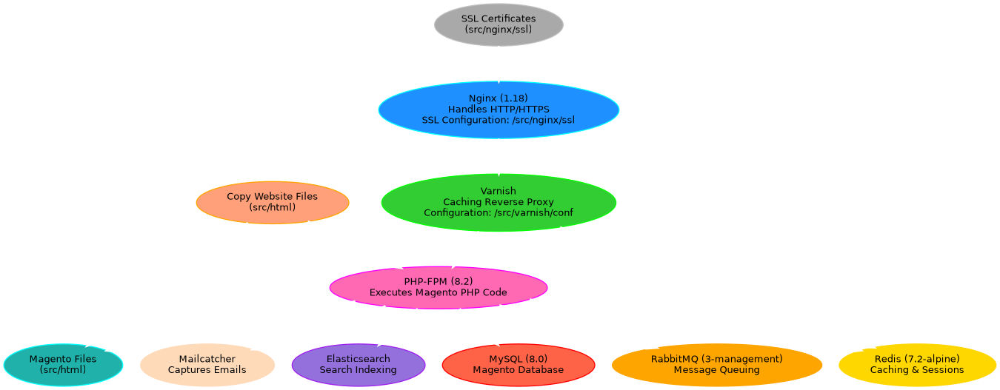

<h1 align="center">Awesome Docker Magento - Ready to Production</h1>
<p align="center">
  
  <a href="https://github.com/intarmour/awesome-agento/graphs/commit-activity" target="_blank"></a>


  <a href="https://opensource.org/licenses/MIT" target="_blank"></a>
  </p>

<p>This repository provides a Dockerized setup for Magento 2.x, enabling an efficient and scalable eCommerce environment. By leveraging Docker, this project simplifies development, deployment, and production workflows with a containerized approach.
</p>



This configuration is intended to be used as a Docker-based production environment for Magento 2.4.x.

Before You Start
----------------

Follow these steps to prepare your project:

1.  **Clone the Repository**:

``` 
git clone https://github.com/Intarmour/awesome-docker-magento.git
cd awesome-docker-magento
```
2. **Edit Virtual Host Configuration:**

*   Replace the placeholder domain mywebsite.com with your own domain in the virtual host configuration file:
```
/src/nginx/conf.d/default.conf
```
*   Place your SSL certificates in the folder: /src/nginx/ssl/ (e.g., cert.pem, key.pem).

3. **Copy Website Files:**

*   Add your Magento website files to the /src/html/ directory.
*   Edit the env.php file (see below) to configure database, cache, and URL settings.

4. **Import Your MySQL Database:**

*   Ensure your Magento database is ready and import it using:

``` 
docker exec -i magento2_mysql mysql -u magento -p<password> magento < dumpfile.sql
``` 
   
Quick Start
----------------
Build and Run the Docker Containers:

1.  **Build and Run the Docker Containers**:
``` 
docker-compose up -d --build
``` 
    
2.  **Verify Services**:
    
    *   **Magento Website**: [https://mywebsite.com](https://mywebsite.com)
        
    *   **Mailcatcher**: http://localhost:1080
        
3.  **Stop Services**:
``` 
docker-compose down
``` 
  

Directory Structure
-------------------
```
/src
├── composer       # Composer configuration files
├── php            # PHP configuration (e.g., php.ini)
├── varnish        # Varnish configuration (default.vcl)
├── nginx          # Nginx configuration
│   ├── ssl        # Folder for SSL certificates
│   ├── conf       # Main Nginx configuration
│   └── conf.d     # Virtual host configurations
├── html           # Your Magento website files
```
Key Configuration: env.php
--------------------------

Replace the placeholders with your project-specific configurations:

```
<?php
return [
    'backend' => [
        'frontName' => 'backbone'
    ],
    'crypt' => [
        'key' => 'your-key'
    ],
    'db' => [
        'table_prefix' => '',
        'connection' => [
            'default' => [
                'host' => 'magento2_mysql',
                'dbname' => 'magento',
                'username' => 'admin',
                'password' => 'passwordmysql',
                'active' => '1',
                'model' => 'mysql4',
                'engine' => 'innodb',
                'initStatements' => 'SET NAMES utf8;',
                'driver_options' => [
                    1014 => false
                ]
            ]
        ]
    ],
    'resource' => [
        'default_setup' => [
            'connection' => 'default'
        ]
    ],
    'x-frame-options' => 'SAMEORIGIN',
    'MAGE_MODE' => 'production',
    'cache_types' => [
        'config' => 1,
        'layout' => 1,
        'block_html' => 1,
        'collections' => 1,
        'reflection' => 1,
        'db_ddl' => 1,
        'eav' => 1,
        'config_integration' => 1,
        'config_integration_api' => 1,
        'full_page' => 1,
        'config_webservice' => 1,
        'translate' => 1,
        'vertex' => 1,
        'compiled_config' => 1,
        'customer_notification' => 1,
        'amasty_blog' => 1,
        'amasty_shopby' => 1
    ],
    'use_scope' => [
        'config' => 1
    ],
    'session' => [
        'save' => 'redis',
        'redis' => [
            'host' => 'magento2_redis',
            'port' => '6379',
            'password' => '',
            'timeout' => '2.5',
            'persistent_identifier' => '',
            'database' => '2',
            'compression_threshold' => '2048',
            'compression_library' => 'gzip',
            'log_level' => '1',
            'max_concurrency' => '6',
            'break_after_frontend' => '5',
            'break_after_adminhtml' => '30',
            'first_lifetime' => '600',
            'bot_first_lifetime' => '60',
            'bot_lifetime' => '7200',
            'disable_locking' => '0',
            'min_lifetime' => '60',
            'max_lifetime' => '2592000'
        ]
    ],
    'cache' => [
        'frontend' => [
            'default' => [
                'backend' => 'Magento\\Framework\\Cache\\Backend\\Redis',
                'backend_options' => [
                    'server' => 'magento2_redis',
                    'port' => '6379',
                    'database' => '0',
                    'compress_data' => '1',
                    'password' => '',
                    'compression_lib' => ''
                ],
                'id_prefix' => '69d_'
            ],
            'page_cache' => [
                'backend' => 'Cm_Cache_Backend_Redis',
                'backend_options' => [
                    'server' => 'magento2_redis',
                    'port' => '6379',
                    'database' => '1',
                    'compress_data' => '1'
                ],
                'id_prefix' => '69d_'
            ]
        ],
        'allow_parallel_generation' => false,
        'graphql' => [
            'id_salt' => 'id-key-salt'
        ]
    ],
    'system' => [
        'default' => [
            'web' => [
                'unsecure' => [
                    'base_url' => 'https://www.mywebsite.com/'
                ],
                'secure' => [
                    'base_url' => '{{unsecure_base_url}}'
                ]
            ],
            'catalog' => [
                'search' => [
                    'engine' => 'elasticsearch7',
                    'elasticsearch7_server_hostname' => 'magento2_elastic',
                    'elasticsearch7_server_port' => '9200',
                    'elasticsearch7_enable_auth' => '0',
                    'elasticsearch7_server_timeout' => '15'
                ]
            ]
        ],
        'dev' => [
            'js' => [
                'session_storage_key' => 'collected_errors'
            ],
            'restrict' => [
                'allow_ips' => ''
            ]
        ]
    ],
    'queue' => [
        'amqp' => [
            'host' => 'magento2_rabbitmq',
            'port' => '5672',
            'user' => 'guest',
            'password' => 'guest',
            'virtualhost' => '/'
        ],
        'consumers_wait_for_messages' => 1
    ],
    'downloadable_domains' => [
        'example.com'
    ],
    'install' => [
        'date' => 'Mon, 14 Nov 2024 18:56:50 +0000'
    ],
    'remote_storage' => [
        'driver' => 'file'
    ],
    'lock' => [
        'provider' => 'db'
    ],
    'directories' => [
        'document_root_is_pub' => true
    ],
    'dev' => [
        'debug' => [
            'debug_logging' => 1
        ],
        'syslog' => [
            'syslog_logging' => 1
        ]
    ]
];
```


Debugging Tips
--------------

*  **Access Container Shell**:
```
docker exec -it <container_name> bash
```
    
*   **View Logs**:
    
    *   **Nginx**: /var/log/nginx/
        
    *   **PHP**: /usr/local/var/log/php-fpm.log
        
    *   **Varnish**: Use varnishlog.

## Credits

- 🌐 [simonenogara.com](https://simonenogara.com)
- 🏢 [intarmour.com](https://intarmour.com)
- 💼 [Simone Nogara](https://www.linkedin.com/in/simonenogara/)
- 💌 [simone@intarmour.com](mailto:simone@intarmour.com)


## License

[MIT](https://opensource.org/licenses/MIT)